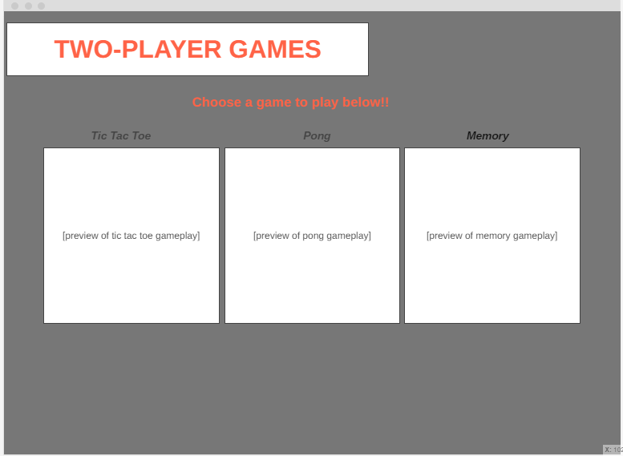

# Two-Player Games

## Description
The website is a collection of two-player minigames; it hass three classic minigames (tic tac toe, pong, and memory game). HTML and CSS will be used to build and design the actual webpages and JavaScript will be used to operate the games.

## Outline and features
The website will include the following pages and features:
- Home page showing the games on the site (linked to the subpages of said games)
- Sub-page for the Tic Tac Toe minigame
- Sub-page for the Pong minigame
- Sub-page for the Memory minigame
  
## Website Layout/Wireframe

### Home Page / Landing Page ###

## Objectives
The objectives of the website are:
- Provide an enjoyable and interactive experience to two players on the same device
- Simulate gameplay of familiar, classic games

## Target Audience
- Friends looking to pass time
- Casual gamers

## Development Approach
The website will be developed using the following technologies and tools:
- HTML, CSS, and JavaScript for front-end development
- Responsive design frameworks like w3.css or Bootstrap
- Replit for collaboration and code management

## Q3 PROJECT REDESIGN
1. Our game website will be responsive
2. We  will finish the code for Pong
3. Improve the framework and CSS
4. Create a set username form (as of now, there is one in the Tic Tac Toe page)

#### Source: Outline in md filetype initially generated by Replit AI