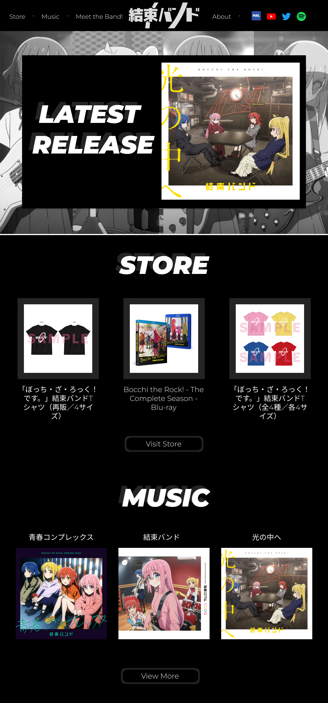
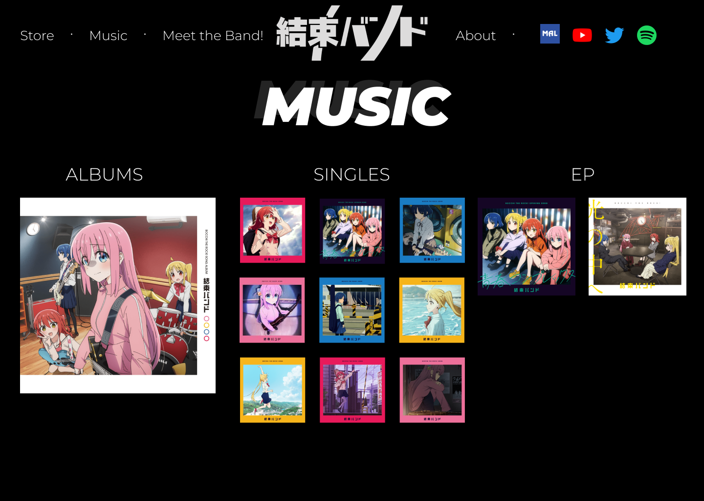
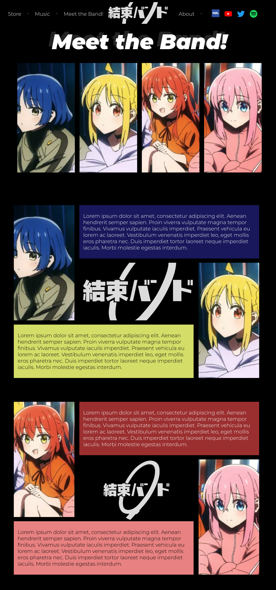
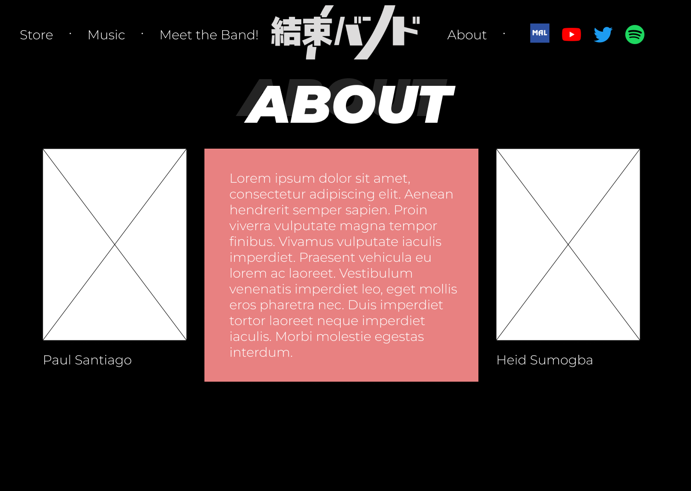
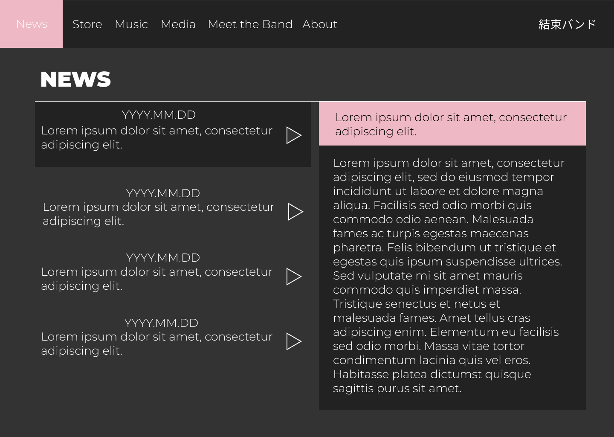
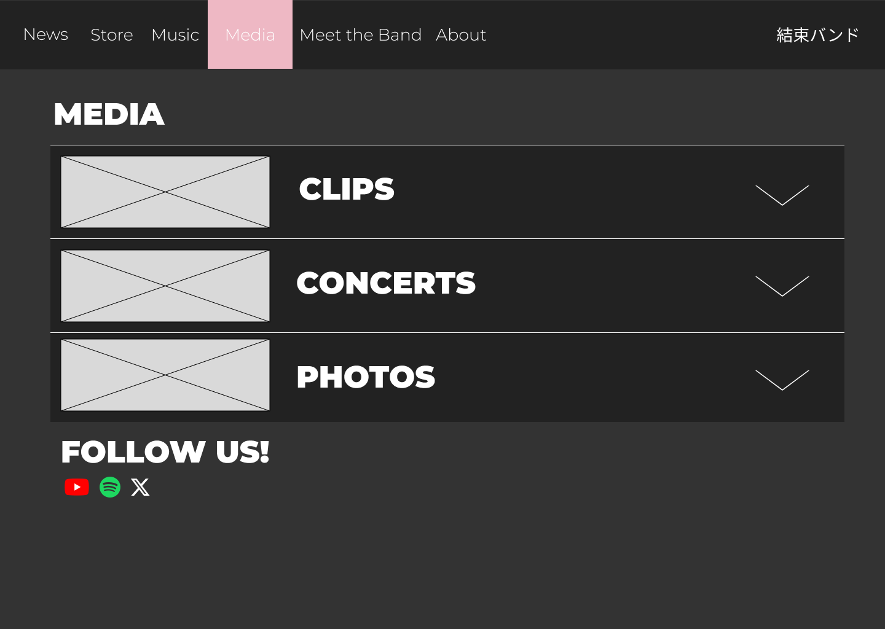
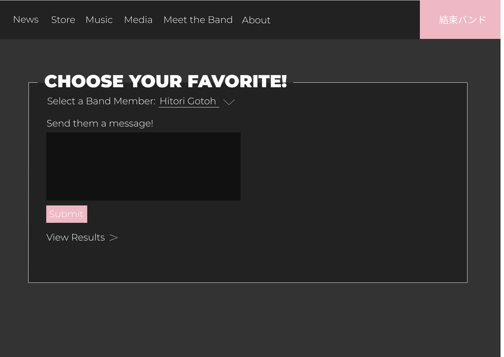
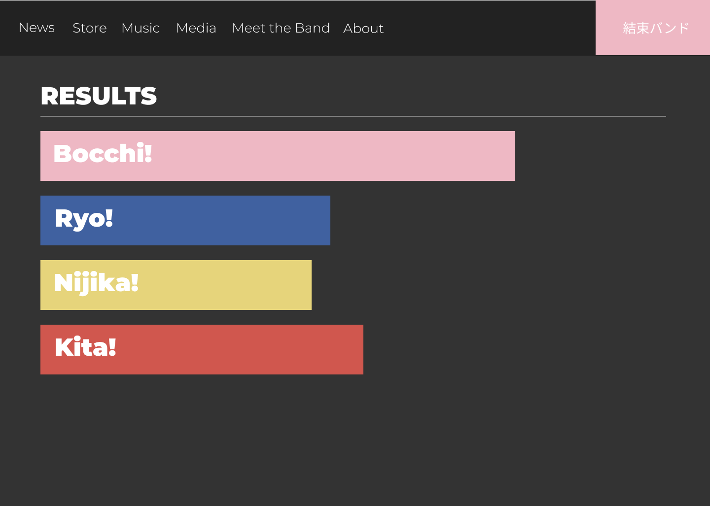

# Kessoku Band

## Description
This is a website dedicated to surreal music scene within Shimokitazawa, Tokyo, featuring the electric and promising new ensemble, "Kessoku Band". To all the fans around the world, we symphatize with your prayers for a more centralized "hub" that this group deseverves, this is why we made this website, this website will serve as the haven for people wanting gain a deeper understanding about the vibrant world of this new rising musical gem.
In the underground artistic scene in Shimokitazawa, Kessoku band is a sore thumb in the surrounding musical landscape, leading many to wonder and ponder about it's existence and presence, to aid with that, this website will provide a rich tapestry of information surrounding the band's journey, musical evolution, and the unique cultural influences that they both produce and get affected by.

Delve into the beating heart of "Kessoku Band", it's members! There will be a dedicated page for the members themselves that go way beyond a bland biography. Explore the different and colorful personalities of each member and gain a nuanced understanding of how their odd personalities and tastes all contribute to make the music we know and love.
The wide digital shelves of this website showcase various merchandise and other paraphernalia. Filled to the brim with stylish t-shirts, collectible posters, high quality physical albums, and so much more! With all these to choose from, the fans will never run out of ways to show their devotion and love in a way that transcends the digital world.

For those new to the scene or just wanting to revisit the auditory delicacies "Kessoku Band" provides, we have an assorted list of their all-time hit songs and their current trending pieces. Immerse yourself with the invigorating melodies, rhytms, and lyrics that has launched "Kessoku Band" to the front of Shimokitazawa's lively musical scene.
All in all, this website is not your typical band website, it is not only a digital hub for all the relevant content surrounding "Kessoku Band" but also a celebration of the electrifying presence at the peak of Shimokitazawa's artistry. We strive to make a website that's just like the band it features, unorthodox, dynamic, and most importanty, filled with passion.

**`Our JS will be implemented through the use of switching to different parts of the website and putting ineractive elements that will enrich the viewing experience of the website.`**

**`from Ma'am Aline - hi, the JS implementation description is too general to be useful and to use it to switch between pages, this could be done by html and css already`**

## Outline and features

1. Home Page:
The Home Page will provide a detailed showcase of the band's latest releases and activities. It's not just about the music; there will be general information about the band, creating a comprehensive introduction for visitors.

2. Store Page:
On the Store Page, fans are invited to explore a range of band merchandise. From stylish t-shirts to collectible posters, the page offers numerous products for fans to order, allowing them to express their love for the band in the real world.

3. Music Page:
The Music Page is dedicated to showcasing an assorted list of Kessoku Band's greatest hits. Fans can browse through the band's musical achievements and enjoy a curated collection of their best tracks.

4. Meet the Band Page:
The Meet the Band Page provides fans with an opportunity to learn more about the individual members of Kessoku Band. It's a space for enthusiasts to connect with the personalities behind the music.

5. About Us Page:
The About Us Page goes beyond the band and offers insights into the creators behind the website. It provides information about the individuals responsible for curating this digital space, adding a personal touch to the overall user experience.
  
## Website Layout/Wireframe

[Place your wireframe image files inside the images folder]

[Tool for Wireframe](https://wireframe.cc/)

### Home Page / Landing Page ###

### Music Page ###

### Meet the Band Page ###

### About Us Page ###

[These 4 wireframes essentially covers the design of the website. The home page will include interactive elements such as buttons so that the user can traverse to other parts of the website. In addition, the navigation bar will be noticeable in every single part of the website so that the user can go back to the homepage.]

## Objectives
1. Introduce newcomers to the band's music:
The website's goal is to make newcomers feel at home and make long-time fans reminisce by showcasing the band's greatest hits through samples and videos. It aims to spark interest and appreciation for the band's unique style.

2. Increase the band's popularity:
The website plans to boost the band's popularity by optimizing for search engines, using social media effectively, and building an online community. It wants to connect with existing fans while reaching out to new ones.

3. Centralize merchandise and music:
The website aims to create a one-stop hub where visitors can easily explore and buy the band's music and merchandise. This helps fans access everything in one place and supports the band financially.

4. Provide band information:
The website serves as a go-to source for fans and newcomers alike, offering straightforward biographies, a band history, a list of songs, and more. It's a place to learn more about the band's journey and connect with their music.

## Target Audience

1. People who don't know about the band but are open-minded:
The website welcomes those who haven't discovered the band yet but are open to new music. It's a friendly space designed to introduce them to the band's tunes and get them grooving.

3. Interested people that want to know more about the band:
If you're curious and want to know more about the band, the website is your go-to source. Dive into biographies, explore the band's journey, and get all the details you're curious about.

3. Already existing fans of the band:
For the fans who already love the band, the website is a home base. It's where you can find all the latest updates, buy merchandise, and celebrate the music you already adore.

4. Music producers and other artists who can collaborate with the band:
Music producers and fellow artists looking for collaboration opportunities, this is your spot. Connect with the band, explore potential collaborations, and be part of the musical journey together.

## Development Approach

1. Front-end Development:
The website's look and feel will be built with HTML, CSS, and JavaScript, ensuring a smooth and engaging user interface.

2. Responsive Design Frameworks:
To make sure the website works well on different devices, we'll use frameworks like w3.css or Bootstrap, creating a consistent experience for users.

3. Version Control System:
Collaboration and code management will be handled efficiently with a version control system, such as Git or replit, enabling smooth teamwork and organized code maintenance throughout the development process.

## 3rd Quarter Proposal

1. Logical and Appropriate Implementation of Forms

Visitors of the page are able to show their love for the band member they resonate the most with! We're going to add a voting system so fans of the band can show their love fo their bias to the whole world!

2. Diverse Use of Form Elements

We plan to implement both option and textarea elements in our form. The former will be used to know the visitor's favorite band member while the latter will be used if the visitor wants to send them a message. 

3. Forms Spans Several Pages

Instead of the form spanning several pages, we have decided to put a button that shows the results specifically the percentages of people who voted for their favorite band member.

4. Identification of Data to be Saved on User's Computers and Identification of Information that can be Derived from the Saved Data

The website will save the user's choice on the form and will have another page which shows the results based on what the user picked. This graph will compare how many times each member has been chosen as the public's favorite. For the messages, the website will output the messages in the results page together with the picture of their favorite band member.

5. One or Two Wireframes of Added Webpages

We are thinking of adding 2 more webpages to our website to further extend it's services. One of them details the latest news happening with the band like major announcements, upcoming albums, fresh gigs, etc. The second page will be about their media, stuff like short recordings of performances, music videos, photos, etc. While we already had such elements scattered throughout the website, we think it would be a better idea to consolidate them into one page.

### News Page ###

### Media Page ###

### Form Page ###

### Results Page ###

6. Improvement suggestion on the layout of the website (up to 2pt bonus)

We will add appropriate media queries to elements that need it to keep our website look good even if it is resized. Also, we plan to add small details to the website especially the store page so that it can look more pleasing to the visitors.

#### Source: Outline in md filetype initially generated by Replit AI