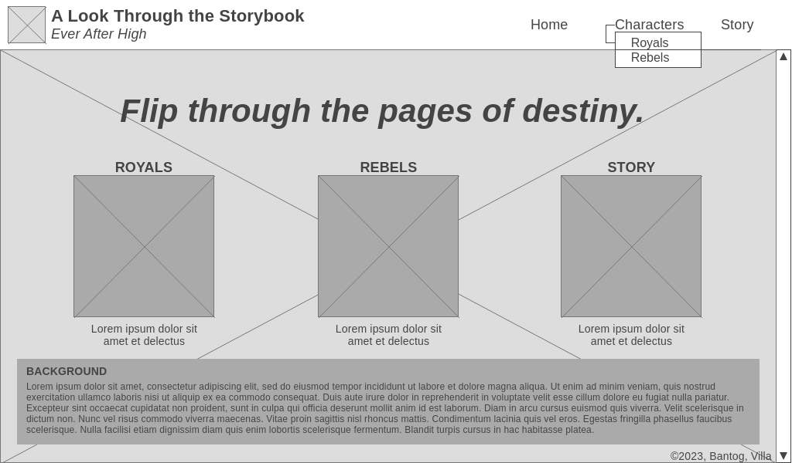
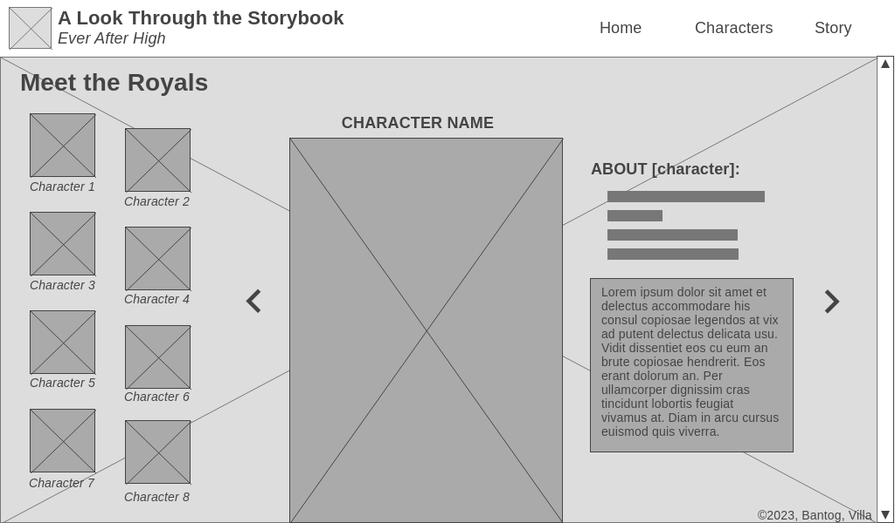
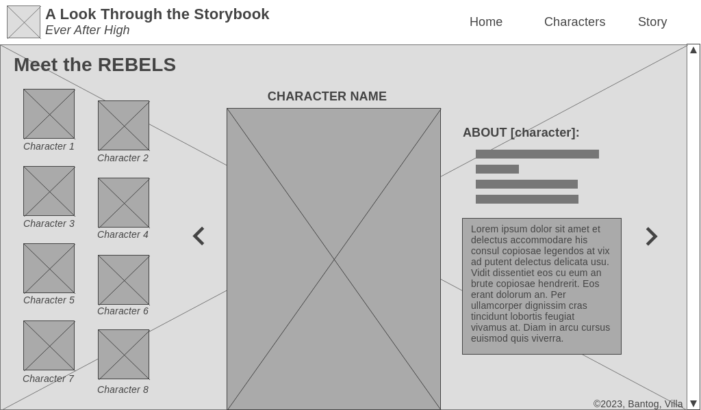
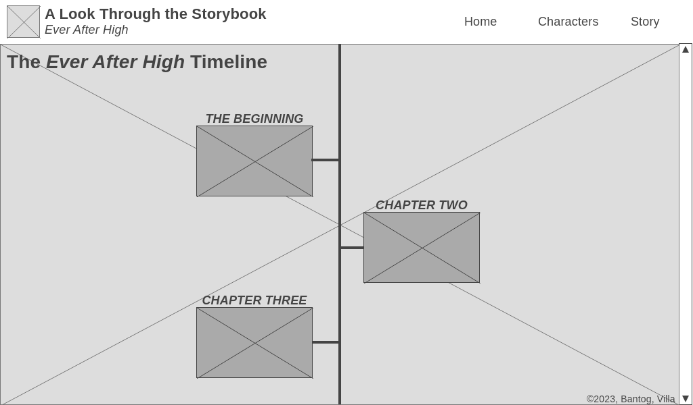
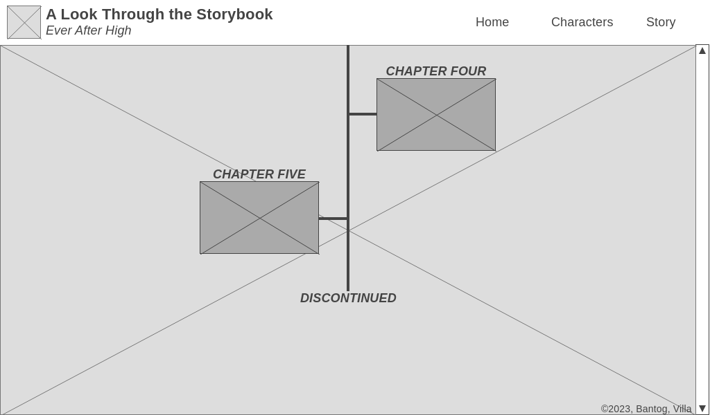
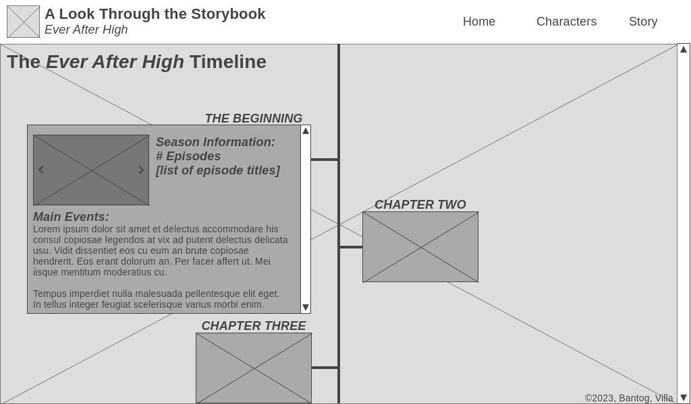
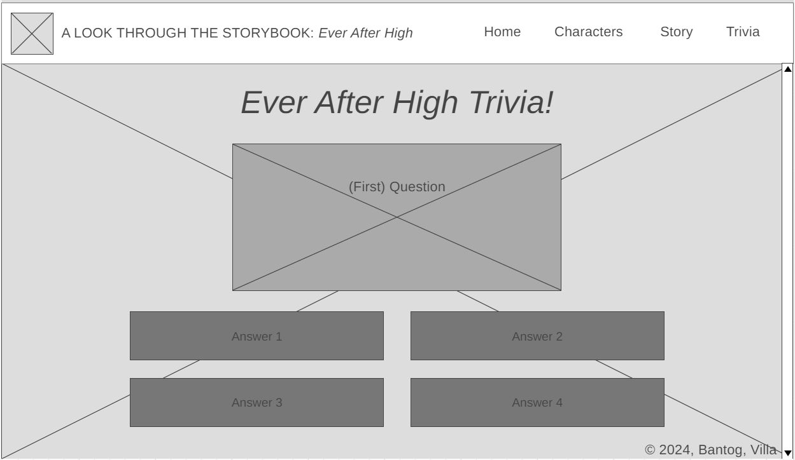
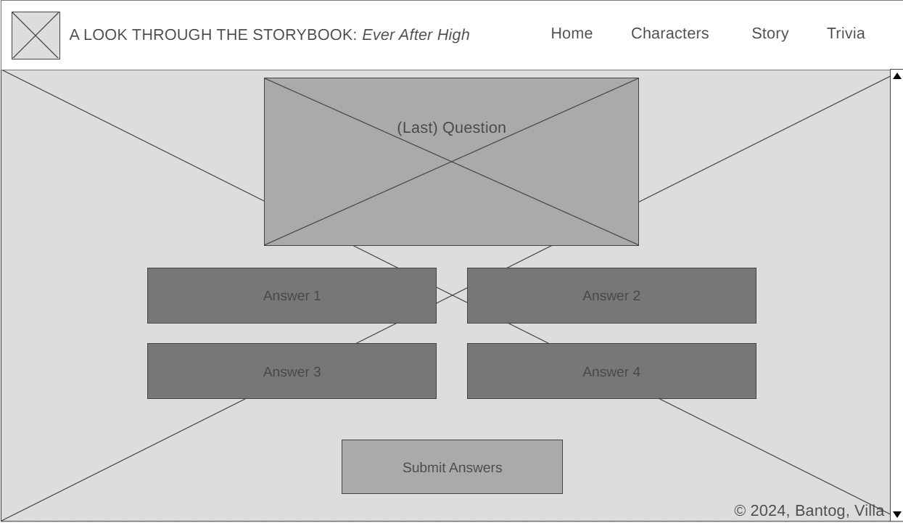
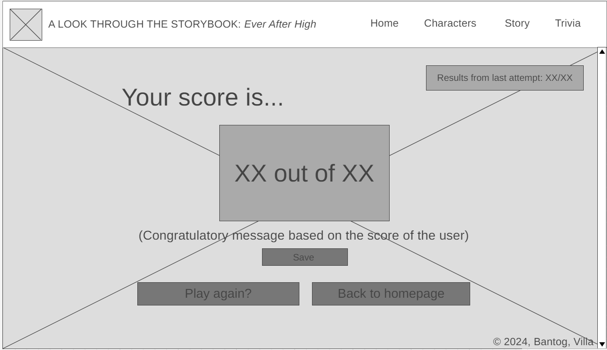

# Website Title
A Look Through the Storybook

## Description
This proposal outlines the design and development plan for a website about the _Ever After High_ franchise by Mattel. One page will highlight the _Rebels_ with 8 characters being showcased, another will highlight _Royals_, and the 3rd will showcase the story timeline of the franchise's series **along with a trivia portion testing you on your knowledge from the wiki**. 

## Outline and features
The website will include the following pages and features :
- Home page with an introduction and highlights the show 
- Royals/Rebel page to provide background information about the characters
- Story page which shows the streamlined timeline and main events in the franchise
- **Trivia page to test the users knowledge from the wiki and the ability to check the last attempt to compare how much they've improved**
  
## Website Layout/Wireframe

[Tool for Wireframe](https://wireframe.cc/)

### Home Page / Landing Page ###

**Home page will add navigations for the new page**

### Content Pages ###

To show the content of the timeline:

**Layout of the proposed trivia page to the website:**

**To show the score and result:**

## Objectives
The objectives of the website are:
- Increase the online presence of the franchise
- Provide information about the characters and the series
- **Offer a fun way to test your knowledge**

## Target Audience
The target audience for the website includes:
- New and old fans alike of all ages

## Development Approach
The website will be developed using the following technologies and tools:
- HTML, CSS, and JavaScript for front-end development
- Buttons for rebels/royal pages **, along with the results tab** via JS
- Styling done via CSS

#### Source: Outline in md filetype initially generated by Replit AI