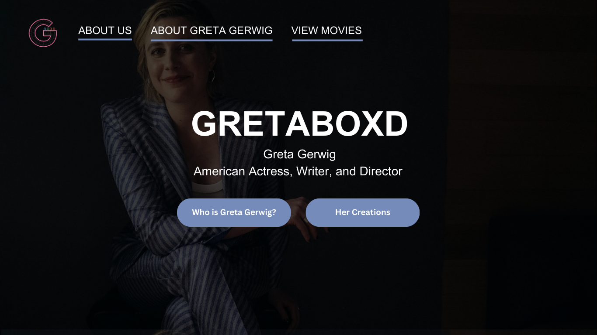
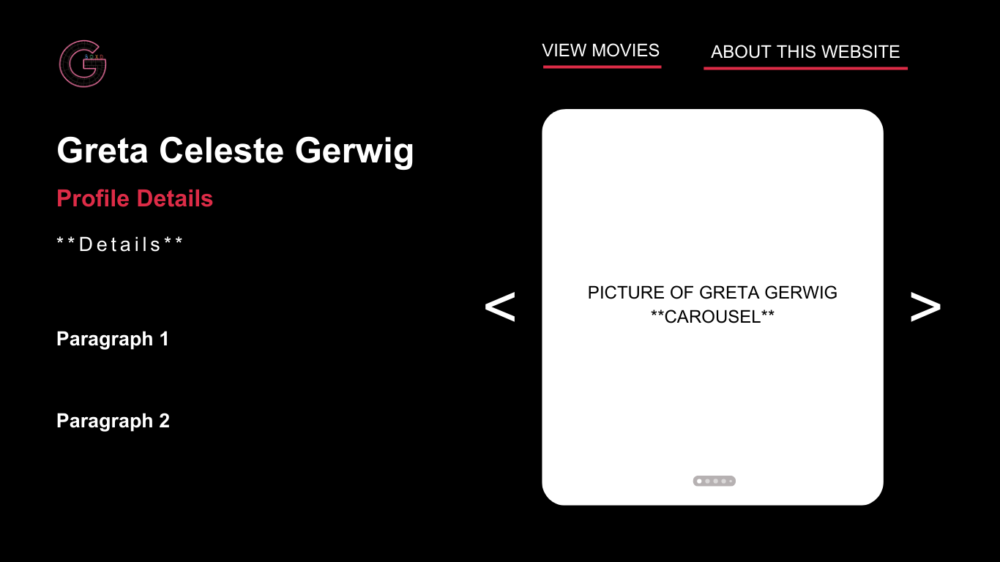
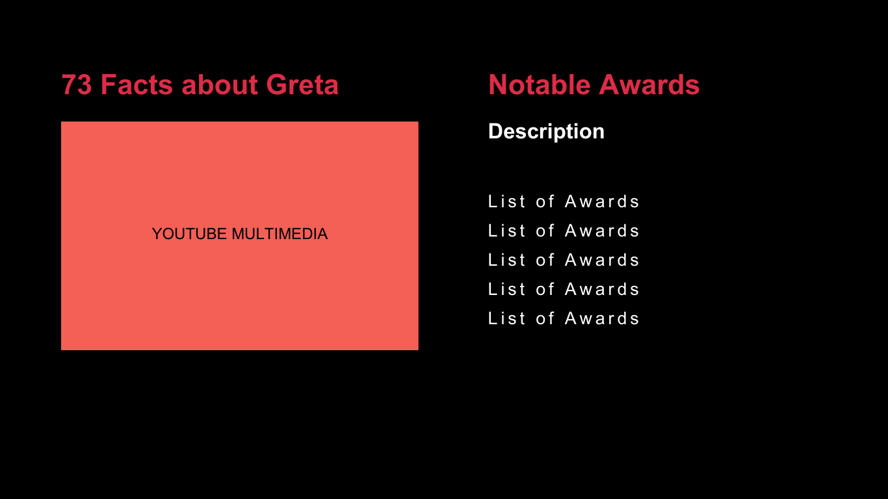
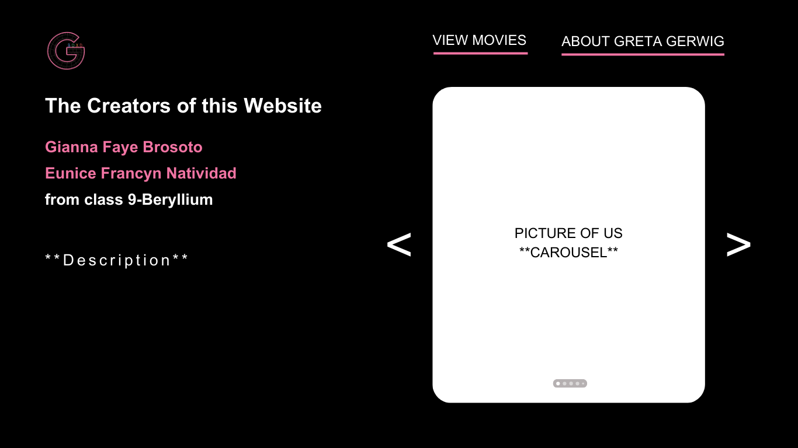
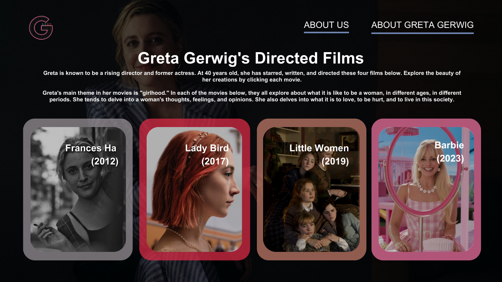
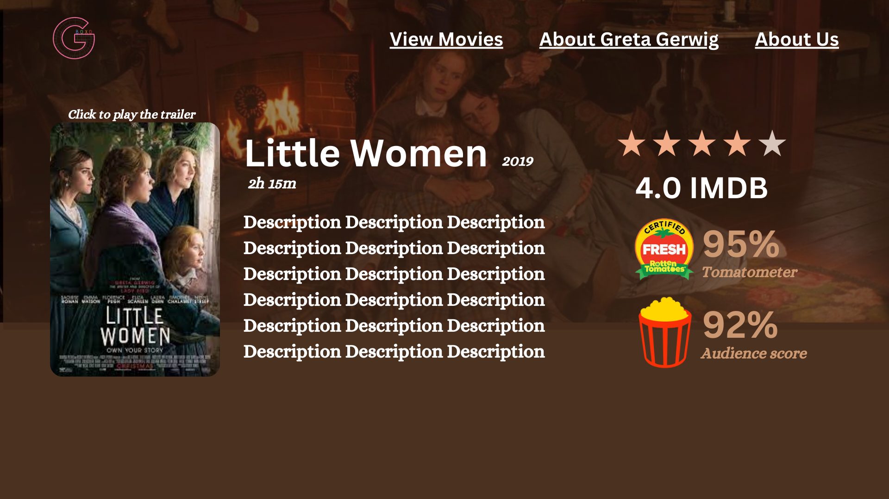
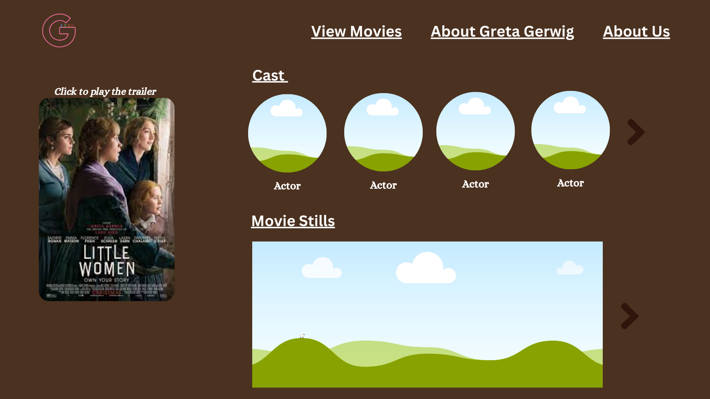
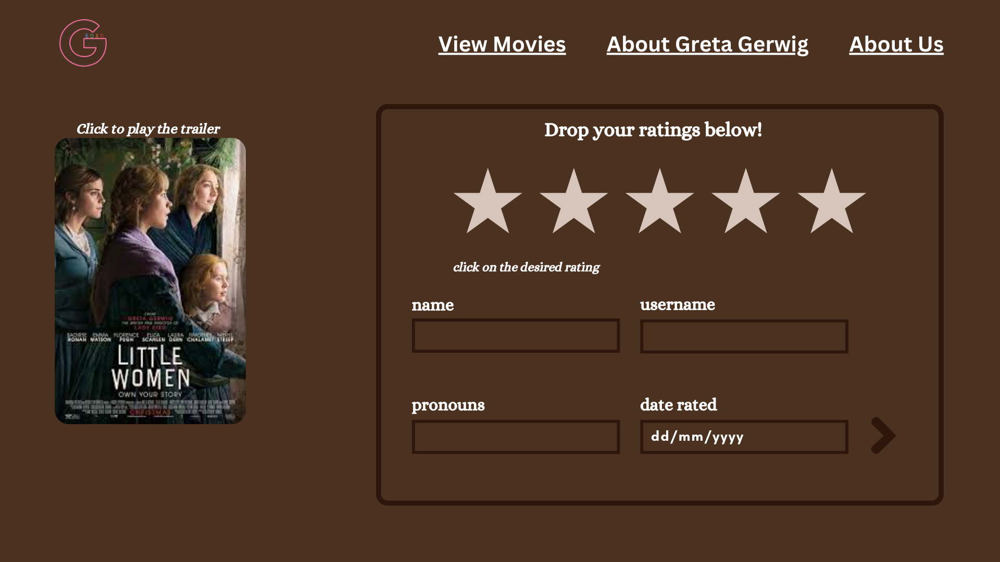
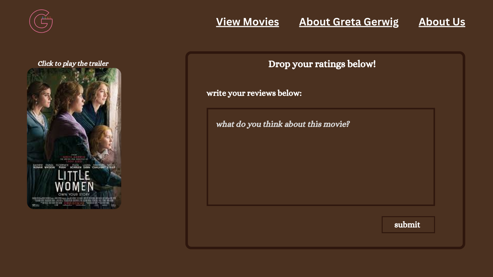
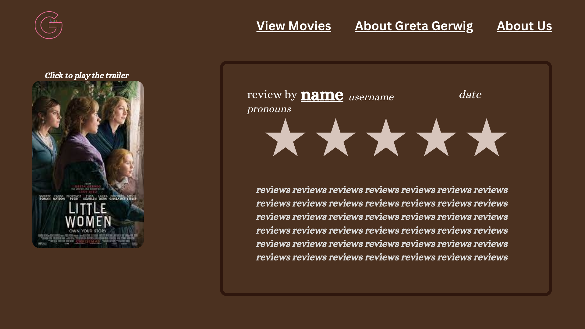

# GretaBoxd

The title is inspired by a film website, LetterBoxd, where it shows a directory of different movies. In our version of LetterBoxd, we will only focus on showcasing Greta Gerwig's work.

## Description

Greta Gerwig is known for her innovative and bold approach to filmmaking, having established herself as a succesful writer, actress, and director up until the present. She wrote and directed criticially acclaimed films "Lady Bird" and "Little Women", both of which popular among the youth and earned her multiple nominations and awards. Her latest film project is the famous "Barbie" film released this year 2023. 

Her works resonates with young audiences like us. From the quirky humor, relatable characters, and heartfelt moments, making her a beloved figure in the contemporary film industry. Our website showcases the four movies Greta Gerwig has directed---Frances Ha, Lady Bird, Little Women, and Barbie. This is to appreciate the depth and sensitivity she brings in her films as well as her exploration of women's issues and relationships.

## JS Incorporation
### Note: All Changes are either in **bold** or in **`this form`**
- Buttons: JS is needed in order to customize and create the buttons so that they will be functional in a way that they would serve their purpose (to go to a different page).
  
- **`Multimedia`**: **The website will have videos in it (like trailers) and audios. JS can be used to put these multimedia files in our website when we want to control when the audio/video can and not play. For example, it must play when mouse is hovered over, otherwise, it will pause.**
- **`Carousel effect/Image Sliders`**: **These kinds of effect can be implemented using JS Bootstrap as well as the use of arrays.**
- **`Multi-step Forms`**: **We plan to use javascript for the incorporation of a multi-step form (see IndivMovie 3,4,5) for getting information about the user and their review about a specific movie. The form will have multi-tabs in one page, instead of creating another page for the form in order to save time and less hassle for the user to answer the form. We will use javascript for the control of tabs, validation of content, and display of the content from the form.**

## Outline and features 
The website will include the following pages and features:
- Home page: with an introduction and highlights of what the website is about. In this case, it is about Greta Gerwig. There will be menu bar on top where the creator's logo and other links for the webpages** (ex. About Us page, View movies page, About Greta Gerwig page) will be located.
- About Greta Gerwig page: This shows a profile about Greta Gerwig. This includes some description about her, and her awards.
- About Us page: to provide background information about the company
- View Movies page: Showcasing a gallery-like view of the movie posters on which the user/visitor can choose from. When they are clicked, it will lead to another webpage containing the chosen movie's description.

- **`The actual movie pages`**: These pages will include the movie poster (with clickable link that will take them to the trailer video of the movie), description about the movie, general ratings of the movie, cast, movie stils, and user's review about the movie. The movie poster will remain static, and the other parts of the movie will be scroll-able.
    1. **`Frances Ha page`** 
    2. **`Lady Bird page`**
    3. **`Little Women page`**
    4. **`Barbie page`**

## Website Layout/Wireframe (Updated!)

[Place your wireframe image files inside the images folder]

[Tool for Wireframe](https://wireframe.cc/)

### Changes to Work On + Improvement Suggestions ### 
- **`Make Home Page the actual website logo`**
- **`Make website layout look good when opened to other devices`**
- **`Try implementing website animations (e.g Fade in/out, Slide left/right)`**
- **`Make color scheme for the Individual Pages matching with its corresponding movie`**
  - **Ex. Little Women - brown; Barbie - pink**

### Home Page / Landing Page ###

### About Greta Gerwig ###
- **Carousel effect implemented**

### About Us Page ###
- **Carousel effect implemented**

### View Movies Page ###
- **When the Image buttons are hovered, they play an audio.**

### Individual Movies Page ###
- **These are pages that are yet to be created in the website**
  - **Planning of implementation of Forms**
 

[Note: Color scheme not final!]

## Objectives
The objectives of the website are:
- Provide information about Greta Gerwig
- Enhance Greta Gerwig's recognition as film director
- Increase online presence

## Target Audience
The target audience for the website:
- Mainly young teenage viewers
    - particularly those who are interested in exploring a variety of movies and films of different genres

## Development Approach
The website will be developed using the following technologies and tools:
- HTML, CSS, and JavaScript for front-end development
- Responsive design frameworks like w3.css or Bootstrap
- Version control system (e.g., Git or replit) for collaboration and code management

#### Source: 
- Pictures used for the website layout are from Wallpaper Cave:
    - Wallpaper Cave. (n.d.). https://wallpapercave.com/