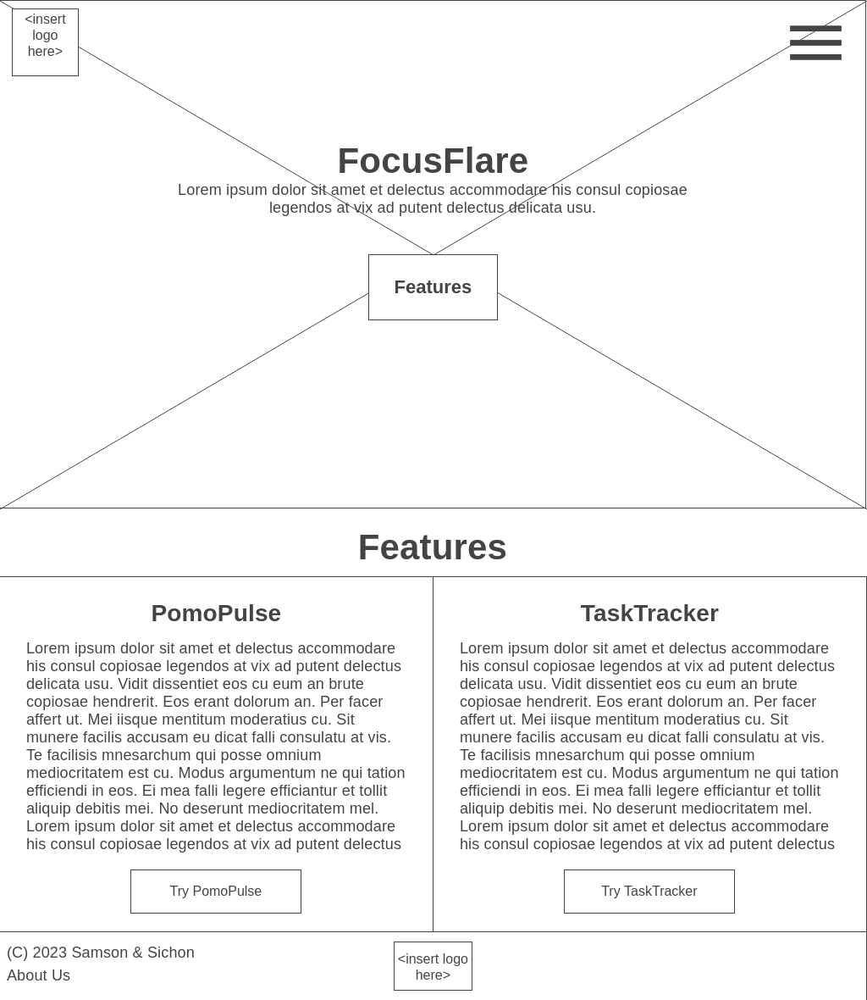
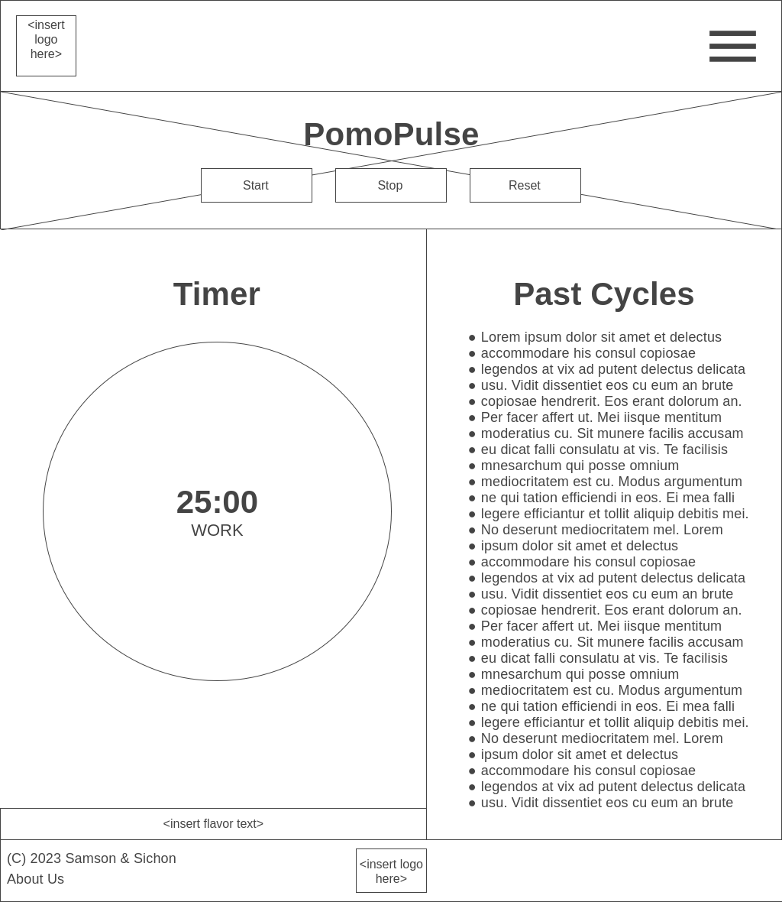
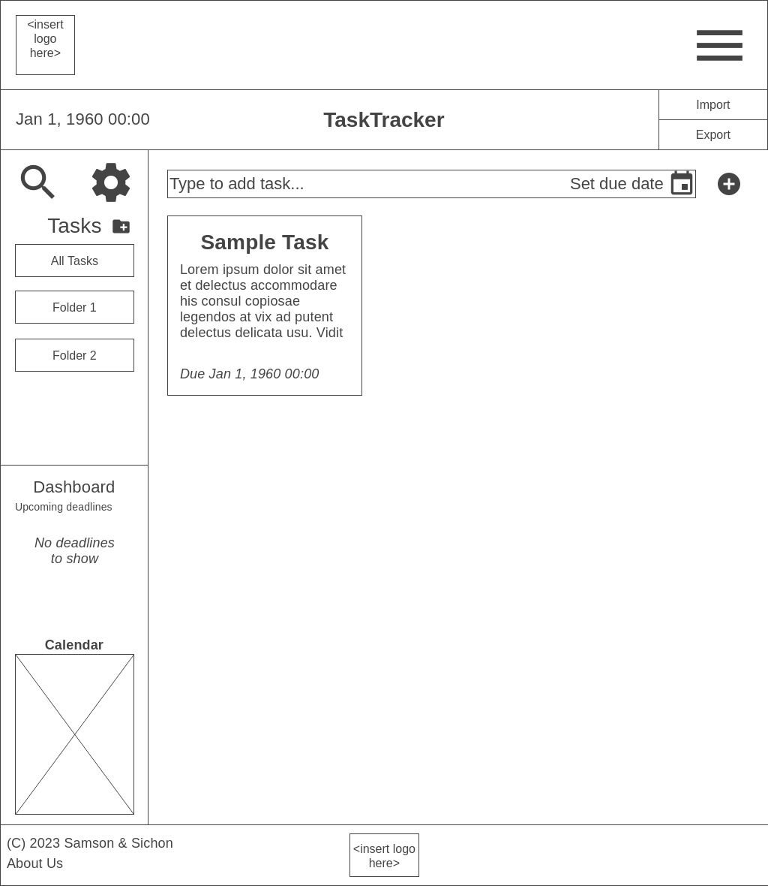
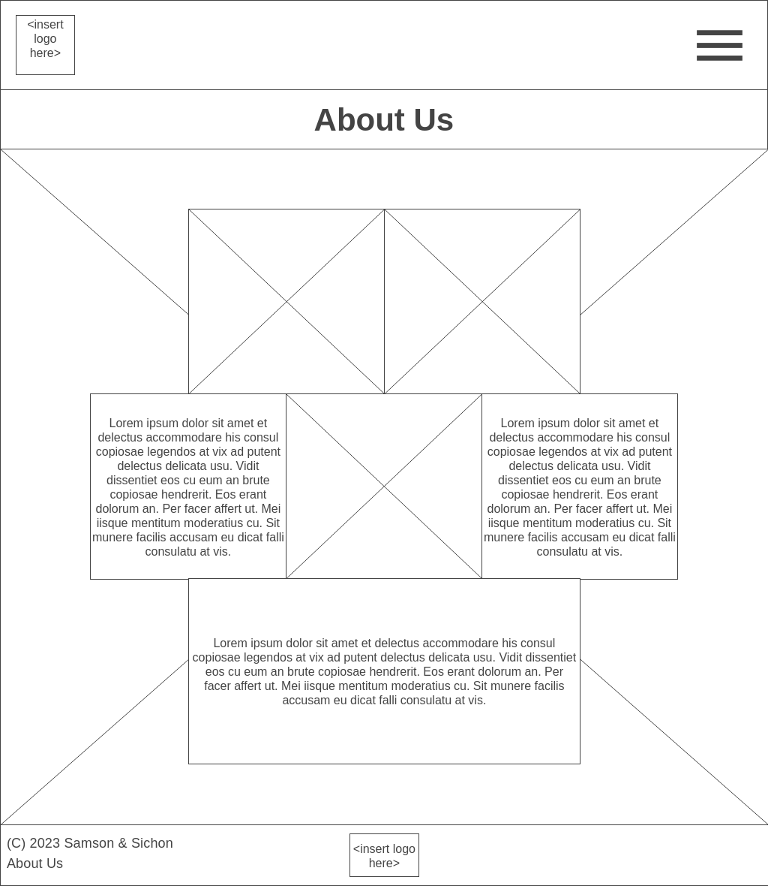
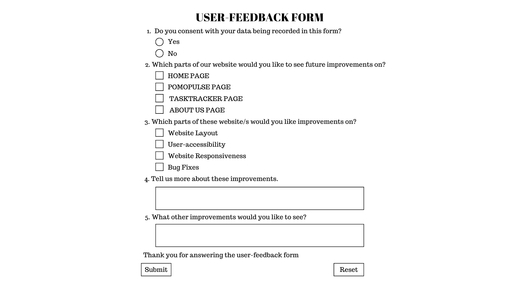

# FocusFlare

## Description
  FocusFlare is a productivity, task and time management tool to aid users in planning and accomplishing their tasks. The website has two tools, PomoPulse and TaskTracker. The PomoPulse contains a pomodoro timer that helps organize a user's time through a series of working and break cycles. The TaskTracker consists of a task planner, sorter, dashboard and calendar to organize and plan activities.

  FocusFlare aims to help students, teachers, professionals, and especially individuals suffering from disorders like ADHD and ADD. Together with our interactive user-interface, we can improve the focus, as well as, provide helpful insight on time management to our dear users. We use tools such as HTML, CSS and JavaScript to develop a website for user accessibility and usage.

## Outline and features
The website will include the following pages and features:

**Home Page:**
- Overview of website and its features: PomoPulse and TaskTracker

**PomoPulse Page:**
- Has a timer made from JavaScript that counts down 25 minutes then switches to a 5 minute timer for a break and switches back and so on. This will also have a section for the record of past cycles the user has gone through.

**TaskTracker Page:**
- Has a task creator/lister and options to add deadlines to tasks, sorted by due date in the dashboard, a folder sorting tool to group activities, and allowing imports/exports through a specially formatted text file that the website can read from using JavaScript.

**About Us Page:**
- Has a description of the developers' thoughts, ideas, and feelings about the project. Furthermore, a section of combined remarks from both developers containing insight on the website.

## Website Layout/Wireframe

### Home Page ###

### PomoPulse Page ###

### TaskTracker Page ###

### About Us Page ###

## Objectives
The objectives of the website are:
- Increase user's productivity and efficiency
- Improve user's focus and accomplishment of tasks
- Maximize a users' time through timers and schedules
- Provide users with insight about time management

## Target Audience
The target audience for the website includes:
- Professionals and Entrepreneurs
- Students
- Teachers
- Freelancers
- Disabled Individuals (People with ADHD and ADD)

## Development Approach
The website will be developed using the following technologies and tools:
- HTML, CSS, and JavaScript used for client-side design and user interface development
- Information on the applications of HTML, CSS, and JavaScript from online sources like w3schools.com, w3.css, Bootstrap, KHub CS3 Modules/Books
- Collaboration and code management of the project through Replit and Discord

#### Source: Outline in md filetype initially generated by Replit AI, Template of Repl provided by CS3 Unit for the project

## Remarks

### 2nd Quarter
- Finish Home Page, PomoPulse Page, About Us Page
- Finish HTML, CSS, JS
- Utilize Bootstrap to layout webpages
- Use icons, spritesheets, and background images
#### Status
- Complete

### 3rd Quarter
- Program site to be responsive (JS)
- Apply checkboxes, radio buttons, buttons, input boxes
  ### Notes
  - This allows our website to be more customizable, flexible, and fit for the needs of our users
    ### How this can be applied
    - Response/User-feedback Form
    