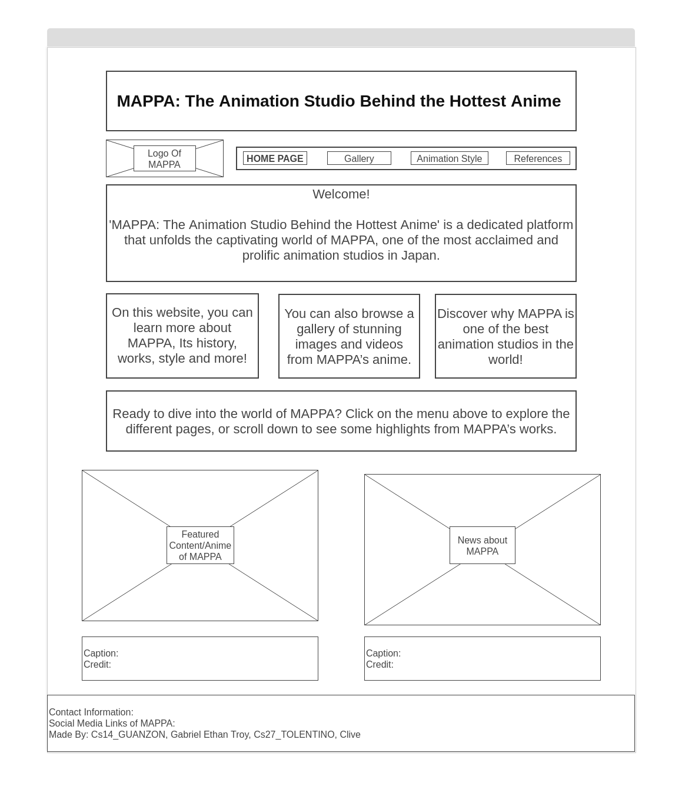

# Website Title

## Description
This proposal outlines the design and development plan for a new website.

**`Add description on how and where JS will be used/incorporated in your website`**

## Outline and features
The website will include the following pages and features (examples only below):
- Home page with an introduction and highlights of products/services
- About Us page to provide background information about the company
- Products/Services page showcasing offerings with detailed descriptions
  
## Website Layout/Wireframe
[Place your wireframe image files inside the images folder]
[Tool for Wireframe](https://wireframe.cc/)

**`updated to include your wireframe files - Ma'am Mendoza`**
### Home Page / Landing Page ###

### Content Page ###

[Extra information regarding your proposal can be placed below to better understand what you want to do (optional)]

## Objectives
The objectives of the website are:
- Enhance brand visibility
- Increase online presence
- Provide information about products/services
- Generate leads and conversions

## Target Audience
The target audience for the website includes:
- Potential customers
- Existing customers
- Partners and stakeholders

## Development Approach
The website will be developed using the following technologies and tools:
- HTML, CSS, and JavaScript for front-end development
- Responsive design frameworks like w3.css or Bootstrap
- Version control system (e.g., Git or replit) for collaboration and code management

#### Source: Outline in md filetype initially generated by Replit AI

## Proposal Topics:
# Anime: All about MAPPA
# Movies: How they are made through time
# Music: