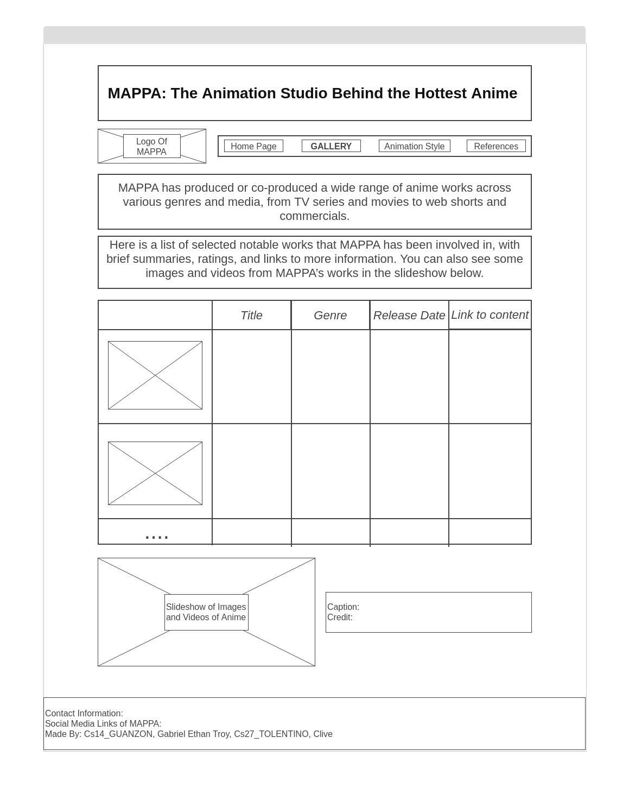

# Website Title
MAPPA: The Animation Studio Behind the Hottest Anime 

## Website Description
Welcome to MAPPA: The Animation Studio Behind the Hottest Anime, a dedicated platform that unfolds the captivating world of MAPPA, one of the most acclaimed and prolific animation studios in Japan. Explore their rich history, witness a gallery of their extraordinary works, and delve into their diverse animation styles. This website serves as a guide, providing enthusiasts and newcomers alike an immersive experience into the artistry of MAPPA.

**Please check the 'Addition' word that is boldfaced to see the additions that we made for the proposal**

## Outline and features
The website will include the following pages and features:
1. **Homepage** - The Homepage has a welcome section that introduces the website and its purpose, and provides a brief introduction to the studio. This page will feature a banner image of the studio’s logo and a navigation bar that will allow users to access the different pages of the website. It will have a banner that displays some of the studio’s works in a slideshow.  It also has featured content showcasing the latest MAPPA release or upcoming project. It has a footer that contains contact information and social media links.

**Addition** for **Homepage**:  Add a news section that updates users on the latest releases and upcoming projects from MAPPA. This can include new releases, awards, and collaborations.
   
2. **Gallery of Works** – This page will have a JavaScript implementation that allows the visitors to browse through the gallery of MAPPA’s works, including anime series and movies. The gallery will have a grid layout displaying thumbnails of MAPPA’s selected notable works. The image can be clicked that will lead to individual pages for each work that will show more details, such as title, genre, year, brief synopsis, images and video trailers, ratings, and links for more information. It has a filter and sorting options for easy navigation based on titles, genres, release dates, etc.  It also features a slideshow of selected images and videos from MAPPA’s works, with captions and credits.

**Addition** for **Gallery of Works**: Remove the text link. Instead, when the user clicks on the section anywhere within the box, it will go to the corresponding link. Add user reviews and ratings for each work to increase interactivity.

3. **Animation Style** – This page will provide an overview of the studio’s animation style, including its technique and tools, such as the use of 2D and 3D animation, the incorporation of music and sound effects, etc. This page will also feature a showcase of the studio’s animation process.

**Addition** for **Animation Style**: Include a selection of drawing templates from which the user can choose from. He can also toggle with a blank template to see his work without the drawing template. Include more visual content such as videos or GIFs to better illustrate the animation process. This would make the page more engaging and informative. Include interviews or quotes from the animators and directors discussing their work. This will give users a more in-depth understanding of the animation process.

**Addition of Forms and other Webpages**

5. **Sign-Up and Log-In Forms**: Implement a user registration and login system. This form can span several pages, asking for basic information (name, email, password) on the first page, preferences (favorite MAPPA work, genres) on the second page, and other information. This data can be saved on the user’s computer. This will allow users to save their favorite works, receive personalized recommendations, and participate in discussions. This also has a feature that asks for the user’s email address and their preferences for what kind of news they want to receive (new releases, events, etc.). The user’s preferences can be saved on their computer for future reference.

6. **User Profle Page**: This page displays the user’s saved preferences and personalized recommendations. It includes sections for favorite works, recommended works, and user settings.

7. **Community Page or Forums**: This page serves as a forum where registered users can discuss their favorite works, share fan art, and connect with other fans. It includes sections for popular topics, recent discussions, and user-generated content.

8. **Feedback Form**: This form could span several pages, asking users about their experience on the website, their favorite works from the studio, and suggestions for improvement. The data from this form could be saved on the user’s computer for future reference.

## Javascript Implementation
The client-facing JavaScript implementation will both be in the Homepage and the Gallery of Works page.
A dynamic slider will be incorporated in the Homepage, showcasing snippets of MAPPA's animation works. This slider will allow users to navigate through different projects by clicking or using arrow keys. It enhances user engagement by providing a visually appealing and interactive way to explore MAPPA's diverse portfolio.
The Gallery of Works page allows the visitors to interact with the gallery of MAPPA’s works. The JavaScript code will create an array of objects that store the information of each work, such as the title, genre, year, synopsis, and image URL. The code will also create a function that displays the thumbnails of the works on the page, and a function that enlarges and shows the details of the works when they are clicked. The code will also create functions that filter, sort, and search the works based on the visitors’ preferences.

## Website Layout/Wireframe
Wireframe images for Homepage and Gallery of Work page are inside the images folder

**`updated to include your wireframe files - Ma'am Mendoza`**
### Home Page / Landing Page ###

### Content Page ###

### Home Page / Landing Page ###
MAPPA: The Animation Studio Behind the Hottest Anime 
[MAPPA Logo]	   Home | Gallery of Works | Animation Style | References

Welcome to MAPPA: The Animation Studio Behind the Hottest Anime, a dedicated platform that unfolds the captivating world of MAPPA, one of the most acclaimed and prolific animation studios in Japan. 

On this website, you can learn more about MAPPA and its history, works, and style, and discover why MAPPA is one of the best animation studios in the world.

You can also browse a gallery of stunning images and videos from MAPPA’s anime.

Ready to dive into the world of MAPPA? Click on the menu above to explore the different pages, or scroll down to see some highlights from MAPPA’s works.

[Slideshow of images and videos from MAPPA’s works, with captions and credits]

[featured content showcasing the latest MAPPA release or upcoming project]

[Footer]
Contact information and social media links.

### Gallery of Works Page ###
MAPPA: The Animation Studio Behind the Hottest Anime 
[MAPPA Logo]	   Home | Gallery of Works | Animation Style | References

MAPPA has produced or co-produced a wide range of anime works across various genres and media, from TV series and movies to web shorts and commercials. Here is a list of selected notable works that MAPPA has been involved in, with brief summaries, ratings, and links to more information. You can also see some images and videos from MAPPA’s works in the slideshow below.

[List of MAPPA’s works, with summaries, ratings, and links]

Thumbnails Title 🔽    Genre 🔽 Release Date 🔽 Link to content
           Bucchigiri  Action
           Jujutsu Kaisen Action

[Slideshow of images and videos from MAPPA’s works, with captions and credits]

[Footer]
Contact information and social media links.
