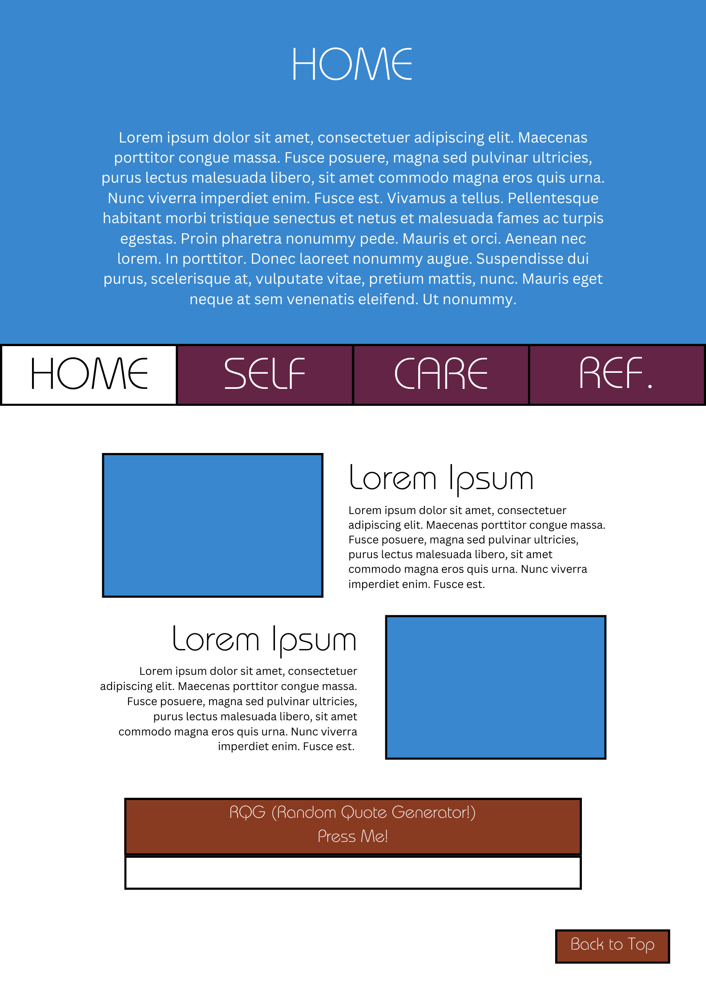
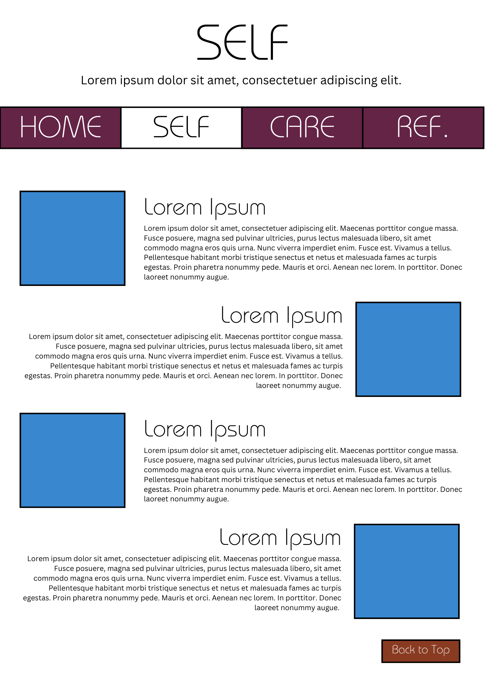
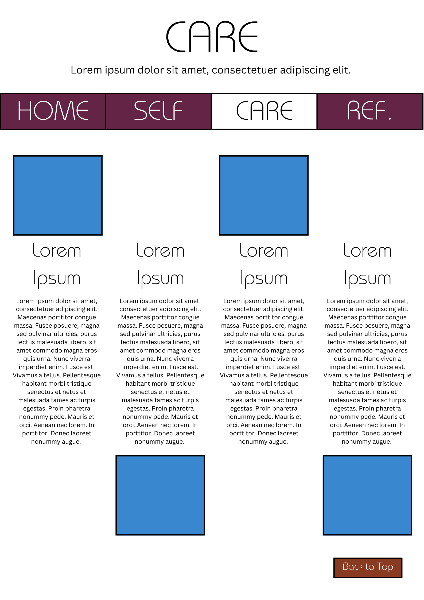
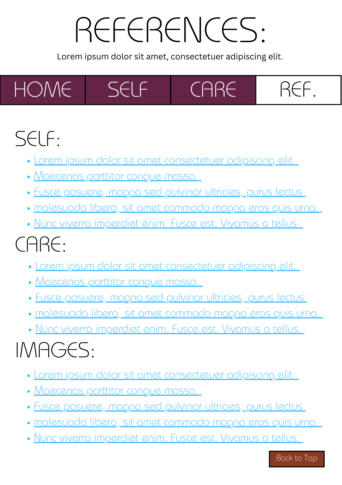
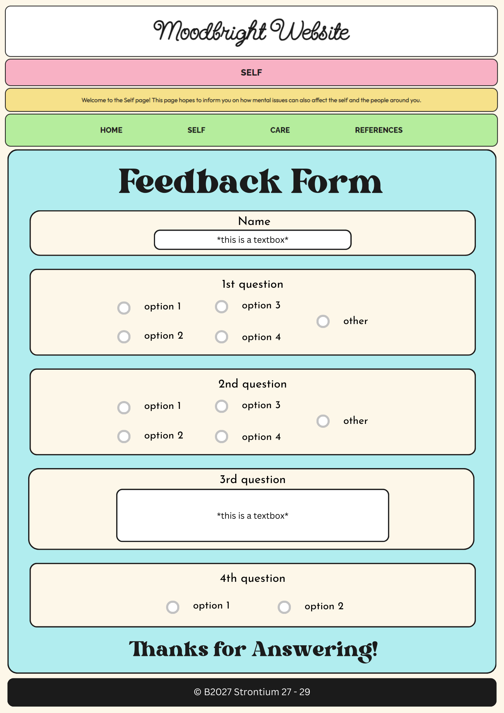

# Moodbright Website

## Description
This proposal outlines the design and development plan for our new website concerning mental health. We will tackle the issues and helping ideas when it comes to these topics, and we will split the pages for those 2.
JS will be used for some features, including:
- a "Back to Top" button for convenience (in which we use a function that brings the user's display to the top of the page)
- a Random Quote generator just to add an additional activity on the home page (in which we use an array of quotes, a random selector using floor function and Math.random, and .value for a display)
- possible animations when certain graphics in the "Self" and "Care" pages are clicked (just with some JS functions working with CSS)

## Outline and features
The website will include the following pages and features:
- Home page with an introduction and highlights of the website, stating its purpose, self-care, and what it provides, helpful ideas.
- "Self" Page to talk about the different issues the users of the website might be facing.
- "Care" Page to talk about what can be done about said issues above.
- "References" Page to compile all resources used in creating the website, possibly using hyperlinks to organize order better.
  
## Website Layout/Wireframe

[Place your wireframe image files inside the images folder]

[Tool for Wireframe](https://wireframe.cc/)

### Home Page / Landing Page ###

There is just a big welcome portion in the beginning of the website for every time someone visits the link or goes back to the home page. The navigation bar will be found below that and will have position: sticky to always be on the screen at the top. 2 main blocks of text summarize the contents of the 2 content pages and a random quote generator can be found below them to go with the theme of mental health. The "Back to Top" button is found at the bottom-right, which will be true for all pages

### Content Pages ###

This page has a small opener, the navigation bar, and text and graphics organised horizontally. The plan is to only have the explanations for each topic appear once clicked and for some of the graphics to have animations.

Similar ideas to the "Self" page but different layout.

Just a references page with links or hyperlinks.

As of now, our website is mostly text and graphics with some added parts to make the experience less stale (refer to JS implementations).

## Objectives
The objectives of the website are:
- Show the importance of mental health
- Increase mental health awareness
- Give tips to take care of your mental health
- Spread good vibes!

## Target Audience
The target audience for the website includes:
- People who may be seeking comfort in a trying time
- People struggling with mental health problems
- People who want to educate themselves on mental health

## Development Approach
The website will be developed using the following technologies and tools:
- HTML, CSS, and JavaScript for front-end development
- Responsive design frameworks like w3.css or Bootstrap
- Version control system (e.g., Git or replit) for collaboration and code management

#### Source: Outline in md filetype initially generated by Replit AI

## Q3 Update
- Our website will be responsive
- We will have a form that looks like this: 
- This form is useful to our site because it gives us constructive critisism coming from other people which can help us improve our site and make it better.
