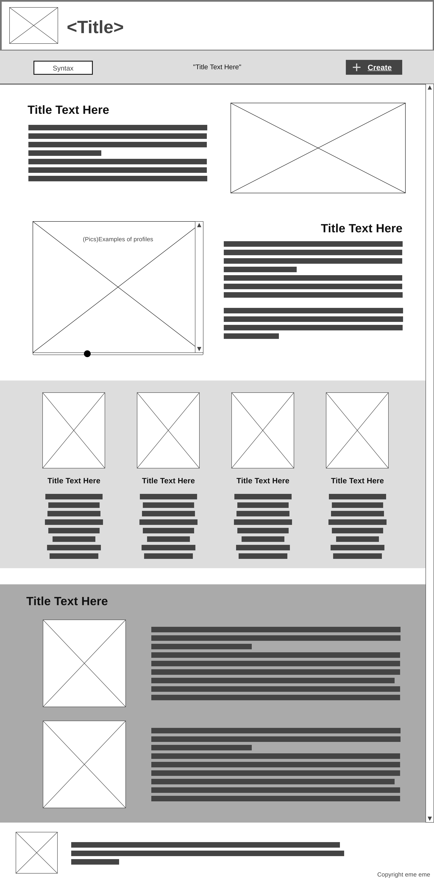
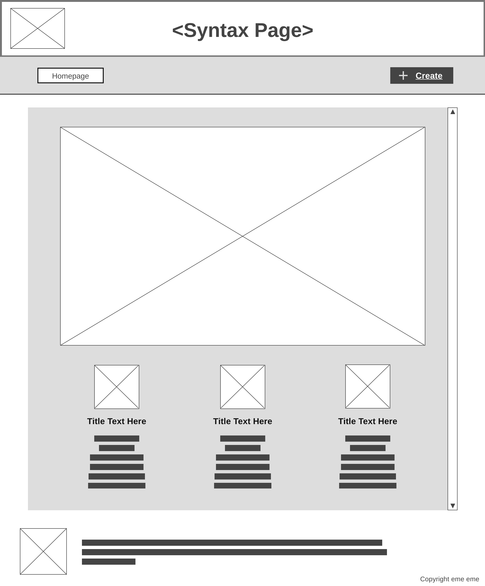
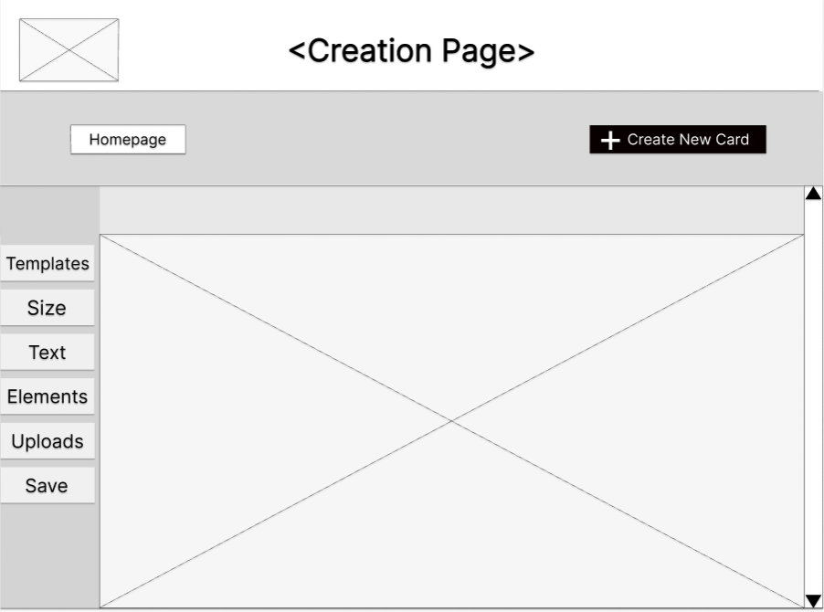
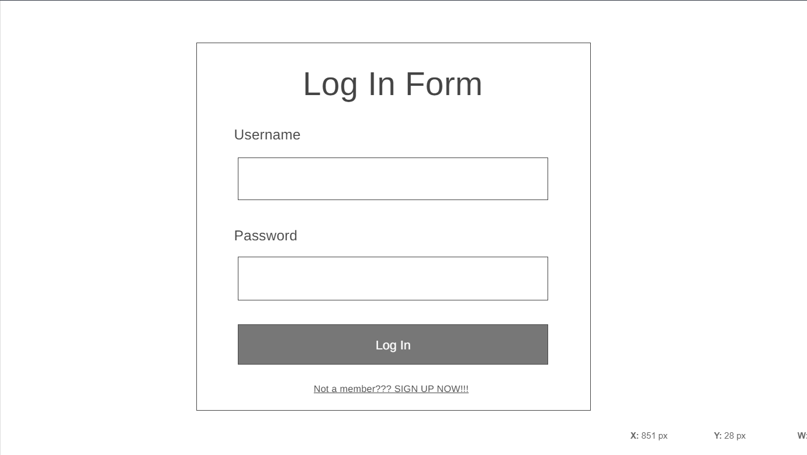
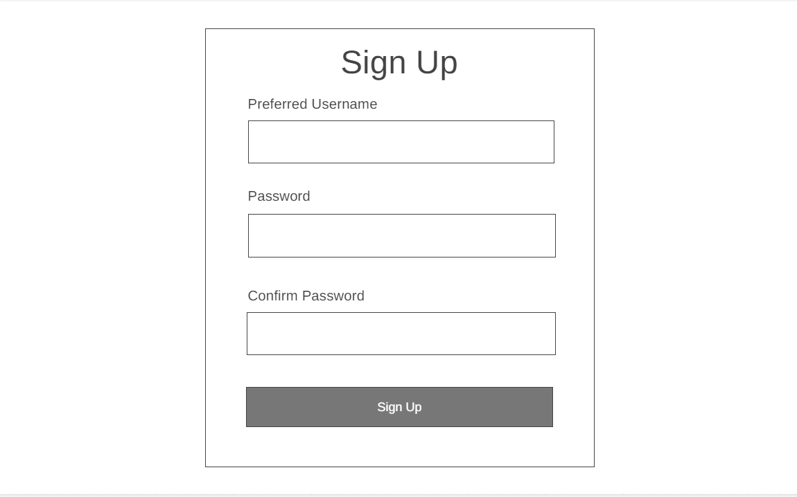
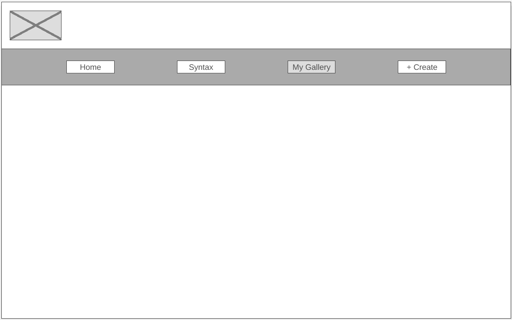

# Mynth

## Description
This website will let users create their cards. They get to choose their own text color and background color. On the homepage, some examples of the cards will be showcased. On the homepage, a series of cards will be shown as examples that will entice new users to interact and utilize our services. These can then be downloaded and used as a concise and summarized introduction to themselves, an OC, someone else, etc.

## Description of JS use
The javascript part of our website will be used to function in the creation of one's card. This part of the coding will be placed in the resources folder. This will be used to save the final output of the person's card. **In addition to these, each box in the form will be marked required if the box is not filled. This will also save your details using the submit button in the login or sign-up form. Once the user has made an account, their main page will be the "My Gallery" page, where they can view saved profiles once they start creating.**

## Outline and features
The website will include the following pages and features:
- Home page with an introduction to the website and its purpose
  - This will contain images of examples of bios (Mr. Salmon and Demry)
  - This will also contain an "about us", information about the creators
- Syntax page showcasing the different functions that can be used when creating your card
- Creation page is where you can finally create your cards

## Website Layout/Wireframe

[Place your wireframe image files inside the images folder]

[Tool for Wireframe](https://wireframe.cc/)

### Home Page / Landing Page ###

### Content Pages ###
**Syntax page**

**Creation page**

**Log In page**

**Sign Up page**

**My Gallery page**

[Extra information regarding your proposal can be placed below to better understand what you want to do (optional)]
**Feb 11, 2024... Changes / Added Features for Project Prop Redesign**
**- Three new pages (Login, Sign Up, My Gallery)**
**- Additional JS Implementation implementing forms and saving users' data**
**- Source of learning for JS codes: W3Schools**
**- Adding a "scroll back to top" button for some pages**
**- Adding a "short description" part in the creation page**

## Objectives
The objectives of the website are:
- Enhance brand visibility
- Increase online presence
- Provide information about products/services
- Generate leads and conversions

## Target Audience
The target audience for the website includes:
- Potential customers
- Existing customers
- Partners and stakeholders

## Development Approach
The website will be developed using the following technologies and tools:
- HTML, CSS, and JavaScript for front-end development
- Responsive design frameworks like w3.css or Bootstrap
- Version control system (e.g., Git or Replit) for collaboration and code management

#### Source: Outline in md filetype initially generated by Replit AI