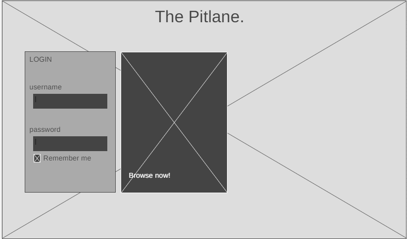
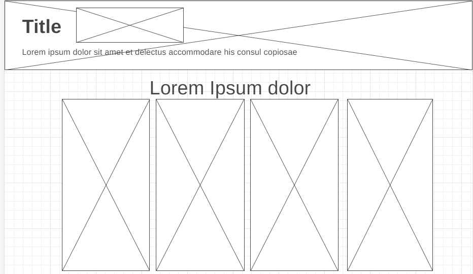
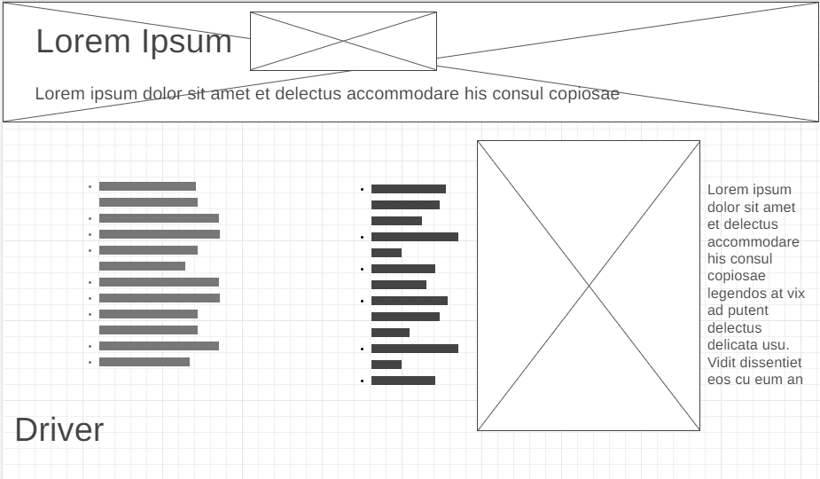

The Pitlane

## Description
As creators of this website have such an interest in Formula 1, with us getting into the motorsport on the late 2010s. We wanted to give users an indepth experience of the current Formula 1 Grid.

Features will include: Homepage, Basics of Formula 1, Driver Profiles of the 2023 Grid, Race Tracks for the 2023 Race Calendar, Constructors or F1 Teams for the 2023 Season, and the part by part of The Formula 1 Car.

**`We will use JS for random trivia or getting to know drivers in our Driver Profiles webpage.`**

## Outline and features
The website will include the following pages and features:
- A user interface to locate the webpages namely "Paddock", "The Basics" and "Driver Profiles", "Race Tracks", "Constructors", "The Formula 1 Car", "History" (if pushed through)
- The "Driver Profiles" webpage will include the name, us describing the F1 2023 Season for him 
- The "Race Tracks" webpage will showcase all about the tracks. It will introduce their track (map and turns), first implemented, and if they're in 2024 Formula 1 Race Calendar.
- "Basics" will cover all the basics of F1, starting from it's Race Flags, Tyre Compounds, Race User Interface, and Race Weekends
- "Constructors" are showcasing all the Constructors of the 2023 F1 Season, and the performance that they've had this season, including all types of race data (Wins, Podiums, Fastest Laps, etc.)
- "The Formula 1 Car" will showcase basically all parts of an F1 Car, starting from the race seat all the way to major parts like "Sidepods", "Front/Rear Wing" etc. 

## Features Extension: Forms Implementation (Added)
1. HTML forms will be used for a dedicated Login page (and a Sign-up page to use when the person doesn't have an account yet) for users, and a review page (A page where users can leave ratings and comments about the website). The existence of a review page calls for an account, thus the reason why we plan to implement login/sign-up pages as well.
2. Data saved for login pages will be the username of the user and the password of the account, essentially the credentials;
   the Sign-up page will initially have the Data needed for the login pages, as you are still setting up your account, including a few other collected information such as gender and a text area to enter the reason why they visited the website.
   As for the website review pages, we will be collecting a Likert-scale based rating of the website from 1 (not impressive) to 5 (commendable), and separate text areas for improvement suggestions, strong points of the website, and other messages that the user wants to convey. To track this survey information, the account used will be associated with the review sent.
3. For the HTML Input types to be used, we will only be using a variety of text fields such as expandable text areas, normal text fields, and password fields, radio buttons, and some checkboxes.
4. A wireframe of a login page is presented below:
   
5.Layout Improvement Suggestion: we will be making images a bit bigger and clearer to see, and put figcaptions on all of them (any kind of text that describes/cites the images as well). We Will also correct the backgrounds of the pages by putting images/colors instead for a better user appeal.

## Website Layout/Wireframe

[Place your wireframe image files inside the images folder]

[Tool for Wireframe](https://wireframe.cc/)

### Home Page / Landing Page ###

### Content Page ###

### Content Page 2 ###

- will have the same UI as Driver Profiles 

[The "Driver Profiles" and "Constructors" are two different webpages ]

## Objectives
The objectives of the website are:
- Expressing our own interest in F1, possibly making people more interested in the sport
- Getting to know more about F1  

## Target Audience
The target audience for the website includes:
- Motorsport fans
- F1 fans (New, or coming back)
- PSHS Community

## Development Approach
The website will be developed using the following technologies and tools:
- HTML, CSS, and JavaScript for front-end development
- Responsive design frameworks like w3.css or Bootstrap
- Version control system (e.g., Git or replit) for collaboration and code management

#### Source: Outline in md filetype initially generated by Replit AI