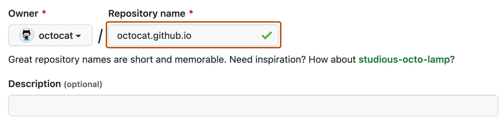
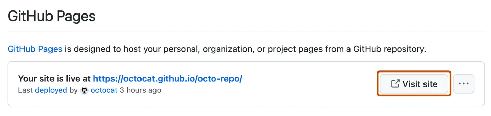

# Creating a GitHub Pages site

You can create a GitHub Pages site in a new or existing repository.
Who can use this feature?

GitHub Pages is available in **public repositories with GitHub Free** and GitHub Free for organizations, and in public and private repositories with GitHub Pro, GitHub Team, GitHub Enterprise Cloud, and GitHub Enterprise Server. 

## Creating a repository for your site

You can either create a repository or choose an existing repository for your site.

If you want to create a GitHub Pages site for a repository where not all of the files in the repository are related to the site, you will be able to configure a publishing source for your site. For example, you can have a dedicated branch and folder to hold your site source files.

If the account that owns the repository uses GitHub Free or GitHub Free for organizations, the repository must be public.

If you want to create a site in an existing repository, skip to the "Creating your site" section.

    In the upper-right corner of any page, select + 

    , then click New repository.

 

    Use the Owner dropdown menu to select the account you want to own the repository. 

    Type a name for your repository and an optional description. If you're creating a user or organization site, your repository must be named <user>.github.io or <organization>.github.io. If your user or organization name contains uppercase letters, you must lowercase the letters. 

    Choose a repository visibility. For more information, see "About repositories."

    Select Initialize this repository with a README.

    Click Create repository.

## Creating your site

Before you can create your site, you must have a repository for your site on GitHub. If you're not creating your site in an existing repository, see "Creating a repository for your site."

Warning: GitHub Pages sites are publicly available on the internet, even if the repository for the site is private. If you have sensitive data in your site's repository, you may want to remove the data before publishing. For more information, see "About repositories."

    On GitHub, navigate to your site's repository.

    Decide which publishing source you want to use. For more information, see "Configuring a publishing source for your GitHub Pages site."

    Create the entry file for your site. GitHub Pages will look for an index.html, index.md, or README.md file as the entry file for your site.

    If your publishing source is a branch and folder, the entry file must be at the top level of the source folder on the source branch. For example, if your publishing source is the /docs folder on the main branch, your entry file must be located in the /docs folder on a branch called main.

    Under your repository name, click 

Settings. If you cannot see the "Settings" tab, select the

dropdown menu, then click Settings.

In the "Code and automation" section of the sidebar, click

Pages.

To see your published site, under "GitHub Pages", click

    Note: It can take up to 10 minutes for changes to your site to publish after you push the changes to GitHub. If you don't see your GitHub Pages site changes reflected in your browser after an hour, see "About Jekyll build errors for GitHub Pages sites."

Notes:

    If you are publishing from a branch and your site has not published automatically, make sure someone with admin permissions and a verified email address has pushed to the publishing source.

## Next steps

You can add more pages to your site by creating more new files. Each file will be available on your site in the same directory structure as your publishing source. For example, if the publishing source for your project site is the gh-pages branch, and you create a new file called /about/contact-us.md on the gh-pages branch, the file will be available at https://<user>.github.io/<repository>/about/contact-us.html.

You can also add a theme to customize your site’s look and feel. For more information, see "Adding a theme to your GitHub Pages site using Jekyll".

To customize your site even more, you can use Jekyll, a static site generator with built-in support for GitHub Pages. For more information, see "About GitHub Pages and Jekyll".
Further reading

    "Troubleshooting Jekyll build errors for GitHub Pages sites"
    "Creating and deleting branches within your repository"
    "Creating new files"
    "Troubleshooting 404 errors for GitHub Pages sites"
