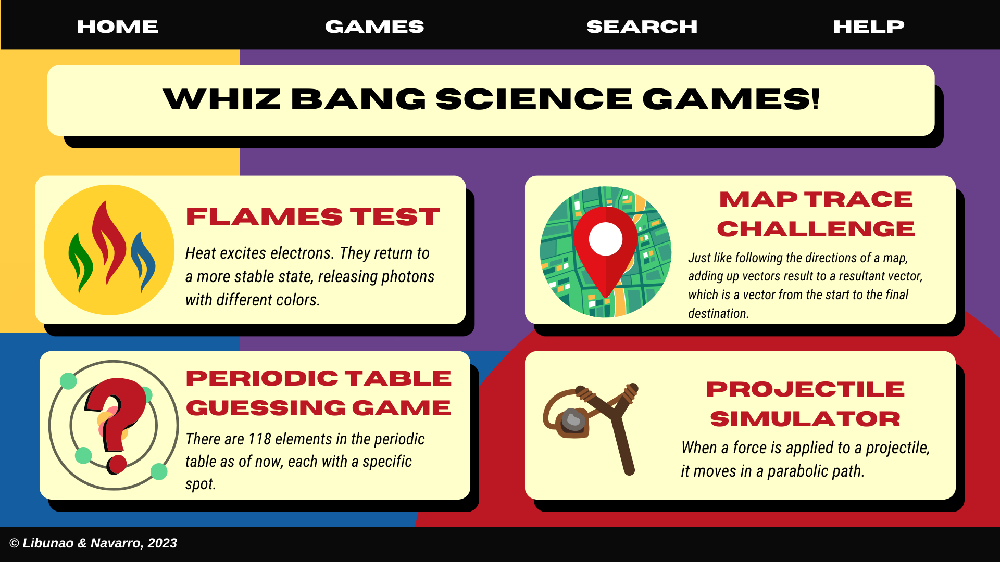
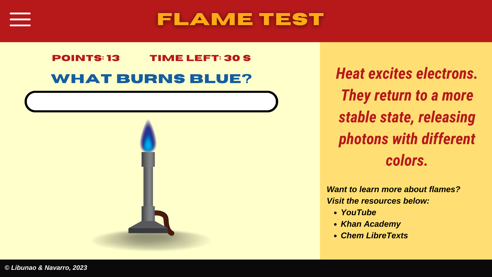
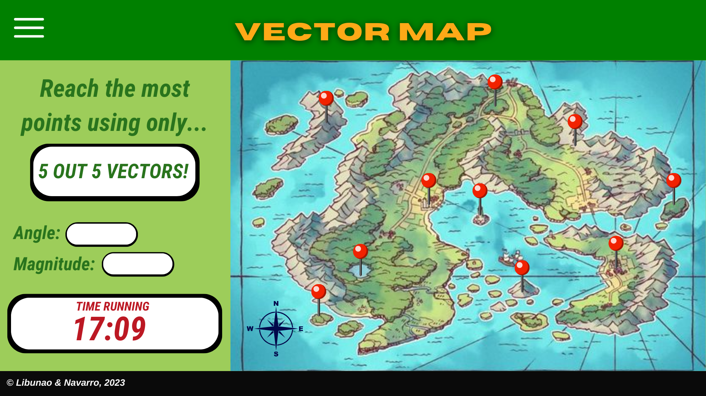

# Whiz Bang Science Games

## Description
Want to have FUN with SCIENCE? Welcome to the Whiz Bang Science Games! In this interactive website, high school students (just like us) can learn all sorts of science lessons through games!

**`Incorporation of JS on website`**
For the flame test website, JS will be used to randomize which flame color will be used to ask which element makes that color of fire, to verify if the answer the user inputted is correct, and to create a timing and scoring system. This will be done by using arrays, math methods (random and floor), and the setInterval method, which is used to execute events at cetain intervals.

## Outline and features
The website will include the following pages and features:
- **Home** page with an introduction about what our page offers. The page will show thumbnail photos of the games and a navigation bar.
- **Periodic Table Guessing Game** - There are 118 elements in the periodic table and it takes a lot of clues to guess one. This game trains users to properly figure out the element described through its different properties such as its atomic number, electron configuration, and trivia. 
- **Flame Test** - Challenges users to guess the corresponding element through the color of the bunsen burner flame. It will also help them figure out the different properties of the element using its flame characteristics. 
- **Target Game** - When a force is applied to a projectile, it moves in a parabolic path. With a few calculations, the user can win the game by shooting all possible shots! 
- **The Art in Shapes** - Create your dream background using the magic of the color wheel and the beauty of shapes! Select any condition you want, and watch your dream picture come to life!
- **
  
## Website Layout/Wireframe

[Place your wireframe image files inside the images folder]

[Tool for Wireframe](https://wireframe.cc/)

### Home Page / Landing Page ###

### Content Page ###

[The picture above shows a sample of the content page. The page interface may vary from game to game but all are similar to each other.]

## Objectives
The objectives of the website are:
- To make learning less tedious and more interactive.
- To help students apply these lessons to real-life game simulations.
- To serve as practice and tests for students.
- To make a creative website applying lessons from STEM.

## Target Audience
The target audience for the website includes:
- Students who are interested in studying the three main fields of Science: Biology, Chemistry, and Physics.
- For those high school students who find the subjects mentioned difficult to understand.
- For teachers and mentors who wish to use an interactive and informative resource for their materials. 

## Development Approach
The website will be developed using the following technologies and tools:
- HTML, CSS, and JavaScript for front-end development
- HTML will be used for the basic framework of the website.
- CSS will be used for the design, images, and special effects of the website.
- JavaScript will be used to randomize objects, create scoring and timing systems, and assist HTML and CSS with the visuals of the games.

#### Source: Outline in md filetype initially generated by Replit AI

<!-- Proposal Checklist:

In a few weeks time our ____ project will be able to do/have the following:
[ ] Follow any lay-out in any device possible (css situation).
[ ] Have two or more projects that focuses on art.  
[ ] Have a propoer logo for our project. 
[ ] Have a more enticing and colorful CSS. 
[ ] To make it fully functional without any errors in running the code. 
[ ] To have it finalized by the time YMSAT ends. 

--> 